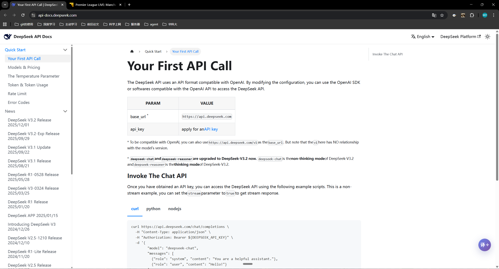
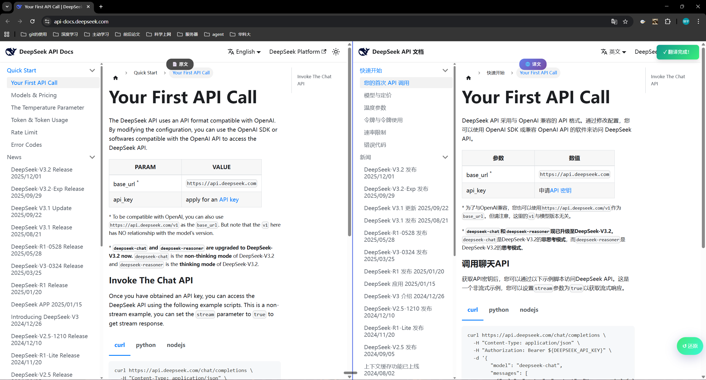
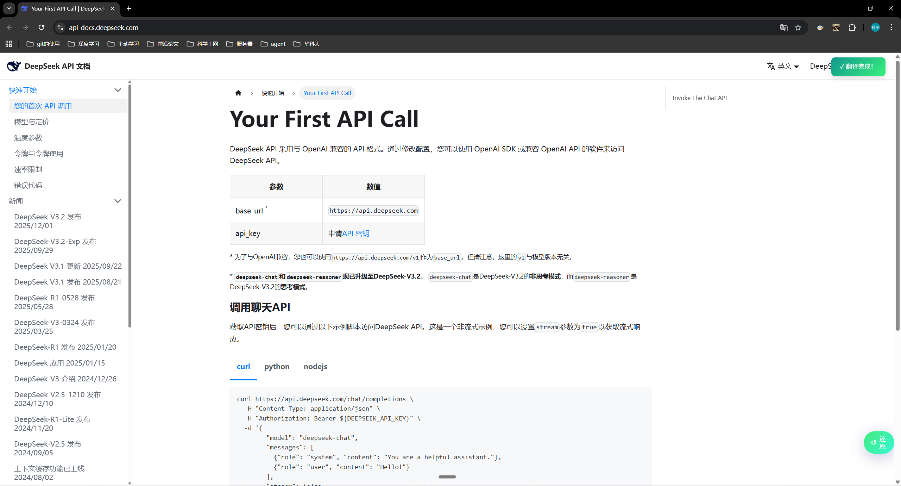

# Self Translation - 全能网页沉浸式翻译助手

  

**Self Translation** 是一款开源的基于大语言模型（LLM）的 Chrome 浏览器沉浸式翻译扩展。它打破了传统机翻的生硬感，利用 DeepSeek 等先进 AI 模型的理解能力，为您提供准确、流畅且保留原文排版的翻译体验。

特别针对 **学术阅读**、**文档查阅** 及 **GitHub 浏览** 进行了深度优化

---

## ✨ 核心特性

### 1. 三大沉浸式翻译模式

**效果演示**
翻译前：


*   **📖 分屏对照 (Split View)【目前还在开发中】**：
    *   左侧原文，右侧译文，左右同步滚动。
    *   
*   **☯ 中英对照 (Bilingual)**：
    *   **（推荐）** 沉浸式体验。智能识别网页段落，在原文下方优雅地插入译文，不破坏原始排版。
    *   
*   **📝 原文替换 (Inline)**：
    *   直接替换网页文字，适合快速浏览大意。
    *   

### 2. ⚡️ 智能抗干扰引擎
为了解决“翻译插件破坏网页布局”的痛点，我们内置了过滤算法：
*   **代码保护**：自动识别并跳过代码块 (`pre`, `code`)，防止代码被错误翻译。
*   **导航过滤**：自动忽略顶部导航栏、侧边菜单 (`nav`)，保持网站功能区整洁。
*   **布局保护**：智能检测“纯链接列表”（如 GitHub 文件列表、Commit 记录），自动跳过翻译，防止页面错位。
*   **短语过滤**：自动忽略 "3 days ago"、"v1.0.0" 等无意义短语，让视野更清爽。

### 3. 🎨 现代化 UI 设计
*   **Glassmorphism 风格**：全新的深色毛玻璃配置面板，极致优雅。
*   **智能悬浮球**：
    *   **静默态**：优雅的 "译" 字悬浮球，不打扰阅读。
    *   **工作中**：显示动态 Loading 圈。
    *   **完成后**：变为「↺ 还原」按钮，一键恢复原文。
*   **自定义图标**：支持自定义图片作为插件图标。

### 4. 🤖 模型支持
*   **DeepSeek AI** (专注于提供极致的翻译体验)

---

## 🛠️ 安装说明

### 方式一：快速安装（小白推荐 ⚡️）
**无需安装任何环境，下载即用。**

1.  **下载插件**：前往 [Releases 页面](https://github.com/zzyt6/self_translation/releases) 下载最新的 `self-translation-release.zip` 压缩包。
2.  **解压文件**：将压缩包解压到一个你不会轻易删除的文件夹中。
3.  **加载到 Chrome**：
    *   在浏览器地址栏输入 `chrome://extensions` 并回车。
    *   打开右上角的 **"开发者模式" (Developer mode)** 开关。
    *   点击左上角的 **"加载已解压的扩展程序" (Load unpacked)**。
    *   选择你刚刚解压出来的文件夹。
    *   🎉 安装完成！

### 方式二：源码编译（开发者推荐 💻）
如果您想自己修改代码或体验最新开发版：

1.  **环境准备**：确保已安装 Node.js (v16+) 和 Git。
2.  **下载源码**：
    ```bash
    git clone https://github.com/zzyt6/self_translation.git
    ```
3.  **安装依赖并构建**：
    ```bash
    cd self_translation
    npm install
    npm run build
    ```
4.  **加载插件**：
    *   按照方式一的步骤，但在最后一步选择项目目录下的 **`dist`** 文件夹。

---

## 🚀 使用指南 (必读)

**⚠️ 注意：本插件依赖 DeepSeek 模型能力，您需要自行准备 API Key 才能使用。**

### 1. 获取 DeepSeek API Key
1.  访问 [DeepSeek 开放平台](https://platform.deepseek.com/) 并注册/登录账号。
2.  进入左侧 **API Keys** 菜单，点击 "Create new API key"。
3.  复制生成的密钥（通常以 `sk-` 开头）。

### 2. 配置插件
1.  点击浏览器右上角的 **Self Translation** 插件图标。
2.  在面板的 **API Key** 输入框中，粘贴您刚才复制的 DeepSeek Key。
3.  点击底部的 **"保存配置"** 按钮。
    *   *看到 "✨ 设置已保存" 提示即表示配置成功。*

### 3. 开始翻译
1.  打开任意英文网页（推荐 GitHub 项目页或英文技术文档）。
2.  点击页面右下角的 **"译"** 悬浮球。
3.  稍等片刻，AI 将为您呈现高质量的双语对照内容。

---

## 💻 技术栈

*   **Core**: TypeScript, HTML5, CSS3
*   **Build Tool**: Vite
*   **Framework**: Vanilla JS (无重型框架，保持极速轻量)
*   **Extension API**: Manifest V3, Chrome Scripting API

---

## 📝 功能建议与反馈

如果您有希望开发的新功能或遇到任何问题，欢迎联系开源作者：
📧 **Email**: zouzhenyu03@gmail.com

---

## 📄 License

[MIT License](LICENSE) © 2025 zzyt6

---
*Code by zzyt6: [https://github.com/zzyt6](https://github.com/zzyt6)*
